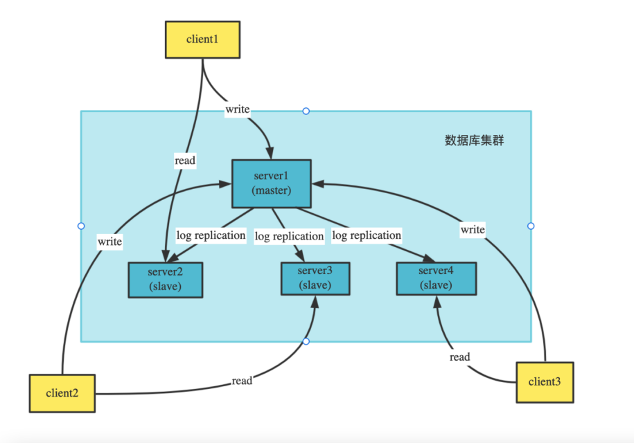
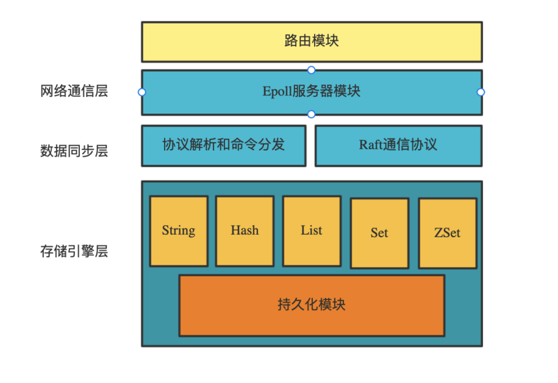
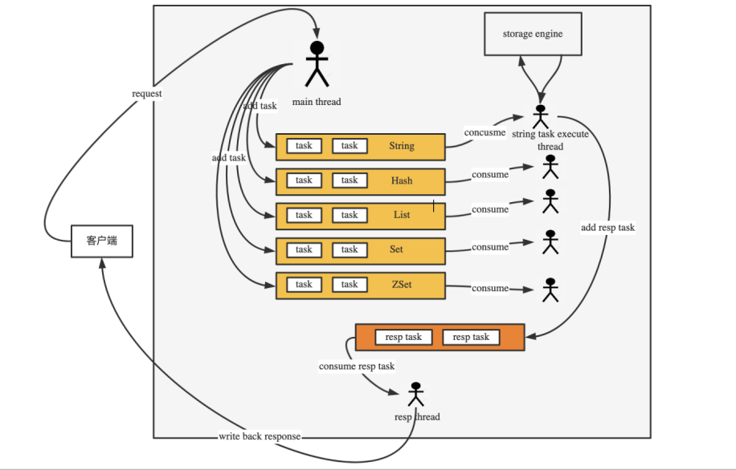

# lightdb


## Introduction
lightdb is a distributed Key-Value data store system based on bitcask model, supporting redis-like data types(String, Hash, List, Set, ZSet) and diverse commands to access it. lightdb has the implemented the capability to deploy as a replication cluster based on Raft consensus algorithm.

### Cluster Structure

the image above shows the network structure when lightdb is deployed as a cluster. The Leader node in the cluster can serve the write requests while Flollower node can serve read requests.

### Overall Design



### Server Structure

this image above has showed the structure of the server of lightdb. with mutipule threads and safe queues to decouple the work of read, data access and write.

## Quick Start

### Build
clone之后，执行./build.sh

### Config File

#### Store Configs
The extension of the store configuration file is.conf
the following is an example of a store configuration file

```conf

#this is a config file
#the port listened by the server
Port  5204
#the directory path where all the files are stored
DirPath  /tmp/test/lightdb4
#the Files access mode，it can be set as FileIO or MMap
FileRWMethod  FileIO
#index mode, can be set as KeyOnlyMemMode（indicating that all keys and values of String type are store in memory）
#or KeyValueMemMode（indicating that only keys of String type are stored in memory）
IndexMode  KeyOnlyMemMode
#the max size of a data file
BlockSize  1048576
#max length of a key
MaxKeySize  1024
#max length of value
MaxValueSize  1048576
#when Sync was set as True, the data will be synced to disk as soon as the write request was served, if the Sync was set as False, data will be be synced to disk when the OS flushed.
Sync  False
#
MergeThreshold  64
#
MergeCheckInterval  3600000
#Max Cache Size
CacheCapacity  1024

```

#### Cluster Config File
lightdb is a distributed data store system, a cluster configuration file is need to launch a lightdb server. The cluster configuration file is on json format, a typical cluster configuration file of lightdb is shown below.
```json
{
  "servers":[
    {
      "num": 0,
      "host":"127.0.0.1",
      "port": 5200
    },
    {
      "num": 1,
      "host":"127.0.0.1",
      "port": 5201
    },
    {
      "num": 2,
      "host":"127.0.0.1",
      "port": 5202
    }
  ],
  "me":0
}
```
The cluster configuration file indicates that this is a three-node cluster, and this node plays the role of node 0 in the cluster.


### Launch a Server
Two args are needed to launch a lightdb server, the first for the path of data store configuration file, the second for the path of cluster configuration file.


#### Client
Run the command below to launch a Client
```sh
./Client 127.0.0.1 5200 # The first parameter is the IP address of the connected server, and the second parameter is the port number
```


